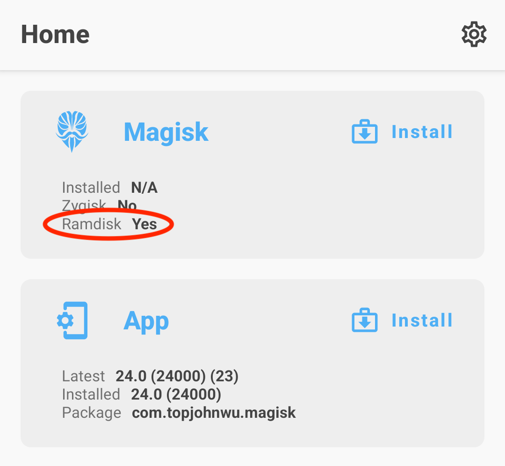

# Magisk安装教程
## 必要
如果您已经安装了Magisk或别的root授权给了magisk，强烈推荐使用Magisk应用程序的“直接安装”方法直接通过Magisk进行升级或安装以下教程仅针对无root安装。

## 入门
开始之前：

本教程假定您理解如何使用adb和fastboot
如果您还不知道什么是 ADB ，那么请查看[Android 调试桥 (adb)](https://developer.android.google.cn/studio/command-line/adb?hl=zh-cn)
如果您还计划安装自定义内核，请在Magisk之后安装
必须解锁设备的引导加载程序
下载并安装最新的[Magisk应用程序]()。在主屏幕中，您应看到：

如果您的设备含有ramdisk分区那么很好您可以继续下面的步骤如果没有请阅读[Recovery中的Magisk]()如果您正在使用三星设备，现在可以跳转到[它自己的部分]()

(不过，有些设备的bootloader接受ramdisk，即使它不应该接受ramdisk，但也有例外。在这种情况下，您必须按照说明操作，就像您的设备的引导分区一样做包括RAM磁盘。没有办法检测到这一点，所以唯一确定的方法是实际尝试。幸运的是，据我们所知，只有部分小米设备已知具有此属性，因此大多数人可以简单地忽略这一信息。)

如果您的设备具有引导ramdisk，请获取boot.img init_boot.img如果存在请优先选择。
如果您的设备不启动ramdisk，获取recovery.img.
您应该能够从官方固件包或您的自定义ROM zip中提取所需的文件。
接下来我们需要知道你的设备是否有单独的vbmeta分区。

如果您的官方固件包包含vbmeta.img，那么是的，您的设备有单独的vbmeta分区
您也可以通过将设备连接到PC并运行以下命令进行检查：
adb shell ls -l /dev/block/by-name
如果你发现vbmeta,vbmeta_a，或vbmeta_b，那么是的，您的设备有单独的vbmeta分区
否则，您的设备不会有一个单独的vbmeta分区。
快速回顾一下，在这一点上，您应该已经知道并准备好：

您的设备是否有引导ramdisk
您的设备是否具有单独的vbmeta分区
是否已获取boot.img,init_boot.img或recovery.img
接下来进行修补镜像文件

## 修补镜像
1.将镜像文件复制到您的手机上

2.打开Magiak应用程序点击安装选择修补文件如果没有ramdisk分区请选择修补recovery文件没有vbmeta请选择修补镜像中的vbmeta

3.选择镜像文件修补完毕后根据路径将修补后的文件上传到电脑

4.开始安装将手机重启进fastboot模式在电脑上执行以下命令
fastboot flash boot[_x] /path/to/magisk_patched_[random_strings].img或
fastboot flash init_boot[_x] /path/to/magisk_patched.img_[random_strings]或
fastboot flash recovery /path/to/magisk_patched.img_[random_strings],
在哪里[_x]应该是_a或_b或清空，具体取决于您的设备
(可选)如果您的设备具有单独的vbmeta分区，您可以修补vbmeta使用命令的分区：
fastboot flash vbmeta --disable-verity --disable-verification vbmeta.img(请注意，它可能擦除数据)

5.重启设备安装magisk程序即可正常使用
## 卸载 
Magisk 的最简单方法是直接通过 Magisk 应用程序。如果您坚持使用第三方 Recovery，请将 Magisk APK 文件 重命名为 uninstall.zip 后像其他普通的刷机包一样刷入。